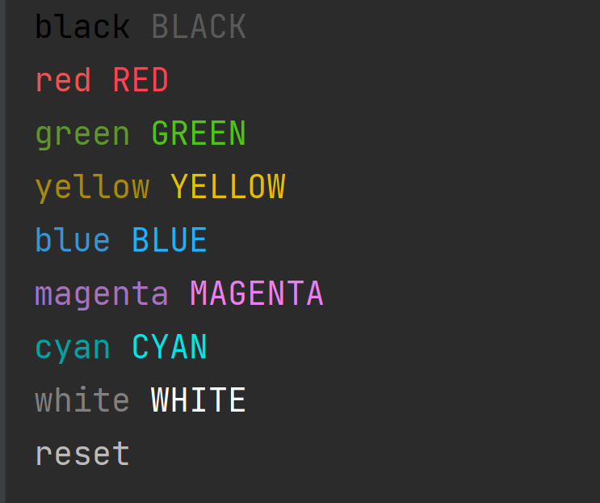

# awsPrint: python的可以指定颜色的print


```python -m pip install awsPrint```

```
from awsPrint import print, FontColor, sepLine
li = {
    'today': 'Mon',
    'time_hour': '15',
    'time_minute': '40',
    'time_second': '20',
    'a': 'xxxxxxxxxxxxxxxxxxxxxxxxxxxxxxxxxxxxxxxxxxxxxxxxxxxxxxxxxxxx'
}
# [print default]: color:'FontColor.YELLOW' isFormat(use pprint.pformat):False
print('Hi CPrint')
print('Hello CPrint', color=FontColor.RED)
print('Hello', color=FontColor.GREEN, end=' ')('world')
print(li, color=FontColor.CYAN)
# [sepLine default] string:'——', multiple:50, color:FontColor.YELLOW
sepLine(color=FontColor.WHITE)
print(li, color=FontColor.cyan, isFormat=True)
```


你可以使用导入的print默认颜色输出，或者通过color参数修改颜色。

🦄function: print  

        增加isFormat参数，是否使用pprint.pformat进行格式化

        增加color参数，指定颜色

        其余参数与python默认的print一致


🦄function: sepLine 

        string:'——'  字符串

        multiple:50, 倍数

        color:FontColor.YELLOW  颜色


🦄class: FontColor

        颜色类

        大写字符代表该颜色的高亮状态


展示所有颜色
```python
from awsPrint import FontColor, sepLine, print
def show_all_color():
    colorLower = []
    colorUpper = []
    for font_key, font_value in FontColor.__dict__.items():
        font_key: str
        if not font_key.startswith('__'):
            if font_key.islower() and font_key != 'reset':
                colorLower.append((font_key, font_value))
            elif font_key.isupper():
                colorUpper.append((font_key, font_value))

    print(colorLower, isFormat=True)(colorUpper, isFormat=True)
    sepLine(color=FontColor.WHITE)
    for lower, upper in zip(colorLower, colorUpper):
        print(lower[0], color=lower[1], end=' ')(upper[0], color=upper[1])
    print('reset', color=FontColor.reset)


show_all_color()

```


